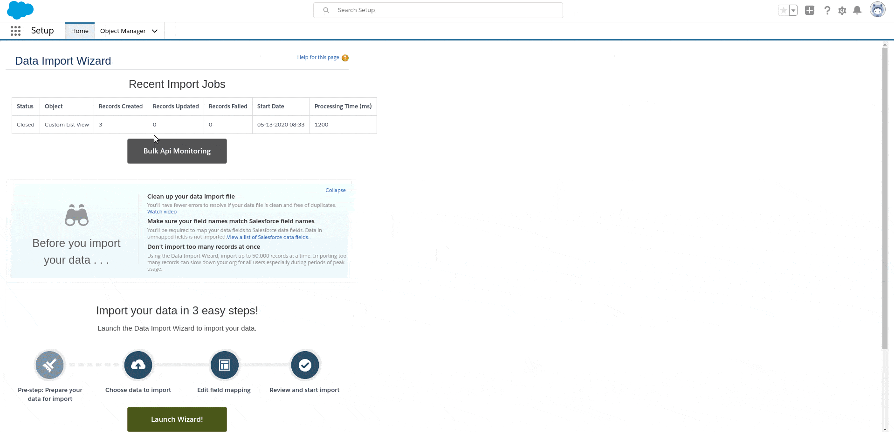

## Salesforce: components generation after import

What if in the scope of testing a Salesforce application we need to generate multiple components like js buttons, list views, objects, lightning components, etc.? Doing this manually can be quite cumbersome and time consuming. This example illustrate a workaround to handle such scenario using MetadataAPI, spcifically the [Metadata API Apex Wrapper](https://github.com/financialforcedev/apex-mdapi)

### Getting Started

What we need?
The solution includes an apex trigger to trigger the batch class with the logic to manage the data (create the components, list views in the example), helper classes and the Metadata wrapper classes. 
What's the idea? The goal is to describe the components we want to generate using a CSV file representing a custom object list of records, for example the name, label, etc, and import the CSV into our organization. 
| List View Name| Object        | Label    | Filter Scope  |
| ------------- |-------------- | -------- |------------   |
| test1         | Account       | Test1 LV |Everything     |
| test2         | Contact       | Test2 LV |Everything     |
| test3         | Asset         | Test3 LV |Everything     |

This import would trigger the generation of the actual components. [Learn more aboout list views filter scope](https://developer.salesforce.com/docs/atlas.en-us.api_meta.meta/api_meta/meta_listview.htm)

### Prerequisites

1- [Obtain a salesforce developer edition](https://developer.salesforce.com/signup)
2- Download the CSV file attached.
3- Clone the project and deploy it to your Salesforce Org.
4- From the developer console execute the method `MetadataServiceUtil.createListviewCustomObject(String objectName)` passing the name of the custom object. This functionality creates a custom object in your org with the required fields to match list views basic elements. (Important: make sure the name of your object matched the one specified in the apex trigger `CustomListViewTrigger`)

### Seeing the code in action!

1- Log in your Salesforce Org.
2- From the Setup, import the CSV file using the Data Import Wizard.
3- Check the list views generated by querying them from the developer console: `SELECT Id, Name, DeveloperName, SObjectType FROM ListView WHERE SObjectType IN ('Account', 'Contact', 'Asset')`
4- The batch class includes the logic to send an email with the results: `The job is finished. A total of 1 batches were processed with 0 failures.`

